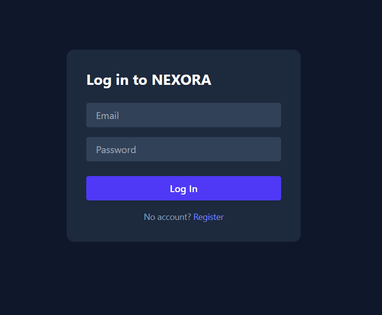
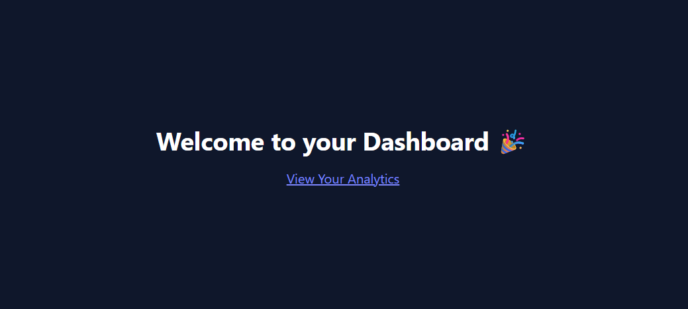
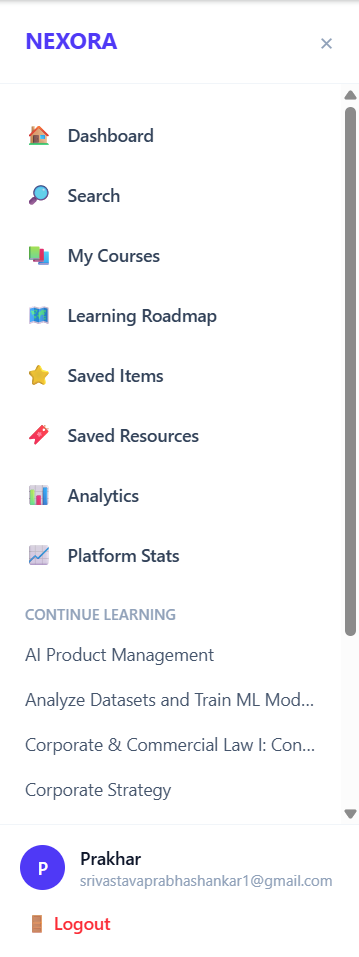
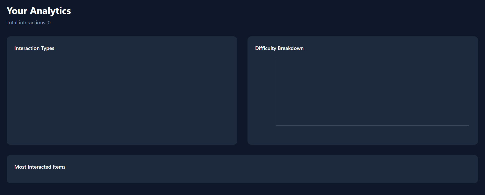
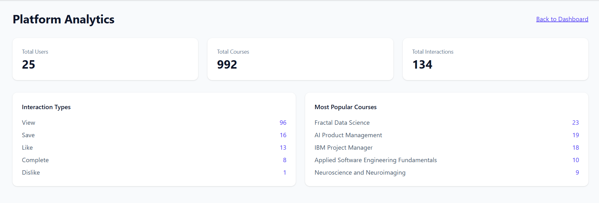

# NEXORA - AI-Powered Personalized Recommendation Intelligence Platform

**Live App**: https://nexora-seven-sepia.vercel.app
**Live API Docs**: https://nexora-backend-ahtm.onrender.com/docs
**Source Code**: https://github.com/prakharsrivastava972-lgtm/nexora

> Note: the backend is hosted on Render's free tier, which spins down after inactivity. The first request after idle time may take ~50 seconds to respond.

---

## Overview

NEXORA is a full-stack AI recommendation platform that suggests personalized learning resources (courses, tutorials, projects) based on a hybrid recommendation engine combining content-based filtering, collaborative filtering, and popularity signals. Every recommendation comes with a human-readable explanation grounded in the actual scoring signals - not a black-box number.

## Problem Statement

Learners face an overwhelming amount of course content online, with generic "top-rated" lists that ignore individual skill level, prior activity, and evolving interests. NEXORA demonstrates how a hybrid ML system can generate genuinely personalized, explainable recommendations that improve as a user interacts with the platform.

## Key Features

- **Hybrid recommendation engine** - combines TF-IDF content similarity, SVD-based collaborative filtering, and popularity signals into one configurable weighted score
- **Explainable AI** - every recommendation includes plain-language reasons generated from real scoring signals
- **Cold-start handling** - new users get popularity/content-based fallbacks; new items work from metadata alone
- **Live feedback loop** - user interactions (views, likes, saves) are stored and available to reshape future recommendations
- **Analytics dashboard** - visualizes a user's interaction patterns with real charts
- **Secure authentication** - email/password (bcrypt + JWT) and Google OAuth 2.0 sign-in, with automatic account linking by email
- **Personalized onboarding** - interest and skill-level selection that seeds initial recommendations
- **Learning roadmaps** - per-course topic checklists with progress tracking, plus curated and YouTube video resources
- **Fully containerized** - one-command local setup via Docker Compose
- **Automated tests** - backend auth flow and ML evaluation metrics covered by pytest
- **Deployed end-to-end** - Vercel (frontend) + Render (backend + PostgreSQL)

## Architecture

React (Vercel) --> FastAPI (Render) --> PostgreSQL (Render)
|
------------------------------
| | |
Content Model CF Model Popularity Signal
(TF-IDF) (SVD)
------------------------------
|
Hybrid Recommender
|
Explainability Layer

## Recommendation Pipeline

User Interaction -> Event Collection -> Profile Update
-> Content-Based Filtering + Collaborative Filtering + Popularity
-> Hybrid Ranking (weighted combination)
-> Explainability Layer
-> Personalized Recommendations

## ML Approach

- **Content-based**: TF-IDF vectorization over course title/description/skills/difficulty, ranked via cosine similarity
- **Collaborative filtering**: SVD matrix factorization over weighted implicit feedback (view=1, click=2, save=4, like=5, complete=7, dislike=-5)
- **Hybrid**: weighted combination - 40% content, 35% collaborative, 25% popularity (tunable in `ml/recommenders/hybrid.py`)

## Evaluation Results

Evaluated on 449 users with held-out relevant interactions (like/save/complete), K=10. Interaction data is synthetically generated (see Dataset section) since real learner interaction logs are difficult to source publicly - so absolute scores are low, but the pipeline is built to plug into real data.

| Model          | Precision@10 | Recall@10 | NDCG@10 |
|----------------|--------------|-----------|---------|
| Popularity     | 0.0018       | 0.0122    | 0.0058  |
| Content-Based  | 0.0009       | 0.0058    | 0.0020  |
| Collaborative  | 0.0004       | 0.0033    | 0.0011  |
| Hybrid         | 0.0016       | 0.0106    | 0.0047  |

## Dataset

- **Items**: [Coursera Course Dataset 2023](https://www.kaggle.com/datasets/tianyimasf/coursera-course-dataset) (Kaggle) - 992 courses after cleaning, with title, description, skills, difficulty, rating, and enrollment data
- **Interactions**: synthetically generated (documented, not claimed as real) to bootstrap collaborative filtering, since public learner-interaction datasets are rare

## Technology Stack

**Frontend**: React, Vite, Tailwind CSS, Recharts, React Router, @react-oauth/google
**Backend**: FastAPI, SQLAlchemy, Pydantic, google-auth
**ML**: scikit-learn, pandas, NumPy, SciPy, joblib
**Database**: PostgreSQL
**Auth**: bcrypt, JWT (python-jose), Google OAuth 2.0 (ID token verification)
**Testing**: pytest, FastAPI TestClient
**Deployment**: Docker, Docker Compose, Render, Vercel

## Screenshots

**Login**


**Dashboard**


**Sidebar Navigation**


**Analytics**


**Platform Stats**


## Installation & Local Setup

### Prerequisites
Python 3.12+, Node 20+, Docker Desktop, Git

### Environment variables

Create a `.env` (or configure directly in `docker-compose.yml`/hosting provider) with:

**Backend**

DATABASE_URL=postgresql://<user>:<password>@<host>:5432/<db>
JWT_SECRET_KEY=<a long random string>
GOOGLE_CLIENT_ID=<your Google OAuth Client ID>.apps.googleusercontent.com

**Frontend** (`frontend/.env.local`)

VITE_API_URL=http://localhost:8000/api
VITE_GOOGLE_CLIENT_ID=<your Google OAuth Client ID>.apps.googleusercontent.com

Google Client ID/Secret are generated in [Google Cloud Console](https://console.cloud.google.com) under APIs & Services > Credentials. Authorized JavaScript origins and redirect URIs must include your local (`http://localhost:5173`) and deployed frontend URLs.

### Clone and run with Docker (recommended)

```bash
git clone https://github.com/prakharsrivastava972-lgtm/nexora.git
cd nexora
docker compose up --build
```

- Frontend: http://localhost:5173
- Backend: http://localhost:8000
- API docs: http://localhost:8000/docs

On startup, the backend automatically creates any missing tables and applies any missing columns to existing tables (see `backend/app/main.py`), so a fresh database is ready to use immediately.

### Manual setup (without Docker)

```bash
# Backend
pip install -r requirements.txt
python ml/features/content_features.py
python ml/recommenders/collaborative.py
uvicorn backend.app.main:app --reload

# Frontend (separate terminal)
cd frontend
npm install
npm run dev
```

## API Endpoints

POST /api/auth/register
POST /api/auth/login
POST /api/auth/google
GET /api/auth/me
GET /api/recommendations/{user_id}
POST /api/interactions
GET /api/users/{id}/analytics
GET /health

Full interactive documentation at `/docs`.

## Testing

```bash
python -m pytest tests/ -v
```

## Limitations

- Interaction data is synthetic, so offline evaluation metrics don't reflect real-world preference signal
- Recency scoring is not yet implemented (requires interaction timestamps in the ranking formula)
- Free-tier hosting means the backend may take ~50s to wake up after inactivity

## Future Improvements

- Preference-aware synthetic data generation for more meaningful offline evaluation
- Semantic search using sentence embeddings
- Learning path generation (sequencing related resources)
- A/B testing framework for comparing recommendation strategies
- Admin dashboard for platform-wide metrics
- Proper migration tooling (Alembic) in place of ad hoc startup migrations

## Author

Prakhar Srivastava
Aditi Srivastava
